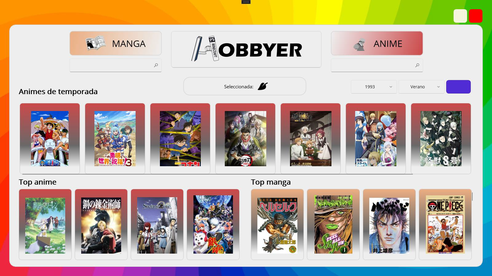

# Trabajo de fin de grado de DAM
----------

Este proyecto se centra en desarrollar una aplicación que unifique la gestión de hobbies.

## Indice
----------
- [Trabajo de fin de grado de DAM](#trabajo-de-fin-de-grado-de-dam)
  - [Indice](#indice)
  - [Autor](#autor)
  - [Descripcion](#descripcion)
  - [Funcionamiento de la aplicación](#funcionamiento-de-la-aplicación)
  - [Capturas de la aplicación](#capturas-de-la-aplicación)
    - [Principales](#principales)
    - [Secundarias](#secundarias)

## Autor
----------

[@victorpereiros01](https://www.github.com/victorpereiros01)

## Descripcion
----------

Se enfoca en el desarrollo de una aplicación de gestión de hobbies utilizando tecnologías como **MAUI**, para la interfaz de usuario; una **API REST,** para obtener los recursos de la web; y **SQL Server** para la base de datos.

Está diseñada para abarcar múltiples categorías como series, peliculas, animes, mangas, videojuegos y libros.

## Funcionamiento de la aplicación
----------
Esta aplicación permite a los usuarios seguir y descubrir nuevos contenidos de manera organizada. Desde la ventana principal, los usuarios pueden ver sus listas de contenidos vistos, favoritos y pendientes, además de acceder a su información de perfil y consultar el tiempo actual mediante un botón que abre el navegador.

En la ventana de configuración (Settings), los usuarios pueden personalizar su experiencia modificando los botones de navegación hacia diferentes hobbies, actualizando su foto de perfil, gestionando sus credenciales (contraseña, nombre de usuario, correo electrónico), y seleccionando el idioma de los contenidos. La aplicación también incluye ventanas específicas para series y películas trending, videojuegos, anime y manga, y libros, cada una con funcionalidades de búsqueda y opciones para explorar los contenidos más populares y relevantes en cada categoría.

Ofrece una experiencia personalizada con funcionalidades comunes en todas las ventanas, como un buscador y popups informativos que permiten guardar hobbies en listas y leer reseñas de otros usuarios. Diseñada para Windows, esta aplicación unifica la gestión de múltiples tipos de contenido en una sola plataforma intuitiva y eficiente.

## Capturas de la aplicación
----------

### Principales
Ventana de inicio
- 
Ventana de login 
- 
Ventana de registro
- 
Ventana de settings
- 

### Secundarias
Ventana de peliculas y series
- 
Ventana de videojuegos
- 
Ventana de anime y manga
- 
Ventanaa de libros
- 